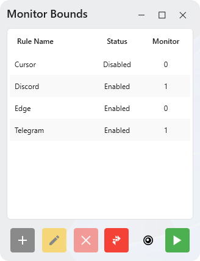
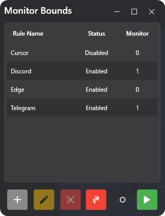
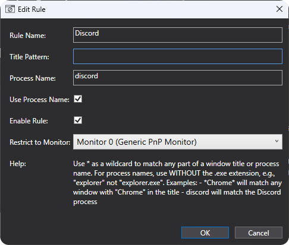

# 
 Screen Region Protector 

## Table of Contents

- [Overview](#-1-overview)
- [Features](#-2-features)
- [How It Works](#-3-how-it-works)
- [Screenshots](#-4-screenshots)
- [Getting Started](#-5-getting-started)
- [Configuration](#️-6-configuration)

## Overview

Screen Region Protector is a lightweight Windows utility that lets you keep application windows within the bounds of specific monitors. It solves the common problem of windows drifting away from their intended screen or accidentally getting moved to the wrong display.

## Features

- **Monitor Specific Windows**: Restrict applications to stay on designated monitors
- **Wildcard Pattern Matching**: Target windows by title patterns with wildcards (* and ?)
- **System Tray Integration**: Runs quietly in your system tray
- **Light/Dark Mode**: Choose between light and dark themes
- **Low Resource Usage**: Minimal CPU and memory footprint
- **Auto-Start Option**: Launch with Windows
- **Configuration File**: Automatically stores your configurations under `%LOCALAPPDATA%\MonitorBounds\settings.json`

## How It Works

Screen Region Protector monitors active windows on your system and automatically repositions them to stay within the boundaries of their assigned monitors. The application runs in the system tray and can be configured with a simple, intuitive interface.

## Screenshots

   
  <em>Light Theme</em>

   
  <em>Dark Theme</em>

## Getting Started

1. Download the latest release from the [Releases](https://github.com/staso-gh/monitor-bounds/releases) page
2. Run the executable
3. Add applications to monitor using the "+" button
4. Specify window title patterns and target monitors
5. Toggle monitoring on/off as needed

## Configuration

- **Window Title Pattern**: Use wildcards like `Chrome*` or `*Photoshop*` to match windows title name
- **Process Name Pattern**: Use wildcards like `discord` or `explorer` (without `.exe`) to match window process name
- **Monitor Selection**: Choose which monitor each application should be restricted to
- **Active/Inactive**: Quickly enable or disable rules without deleting them
- **Theme Selection**: Switch between light and dark themes based on your preference

   
  <em>Edit Rule Window</em>

## Technical Details

- Built with .NET and WPF
- Uses Windows API hooks to monitor and manage window positions
- Efficiently handles multiple displays and scaling configurations
- Minimal performance impact (~0% CPU usage in most scenarios)
- TODO: Minimal memory footprint (Currently hovers around 100MB after prolonged use, memory profiler reports appox. 60-80% is unused space, any help on this is appreciated)

## Requirements

- Windows 10 or 11
- .NET 9.0 Runtime

## Contributing

Contributions are welcome! Please feel free to submit a Pull Request.

---

Made with ❤️

